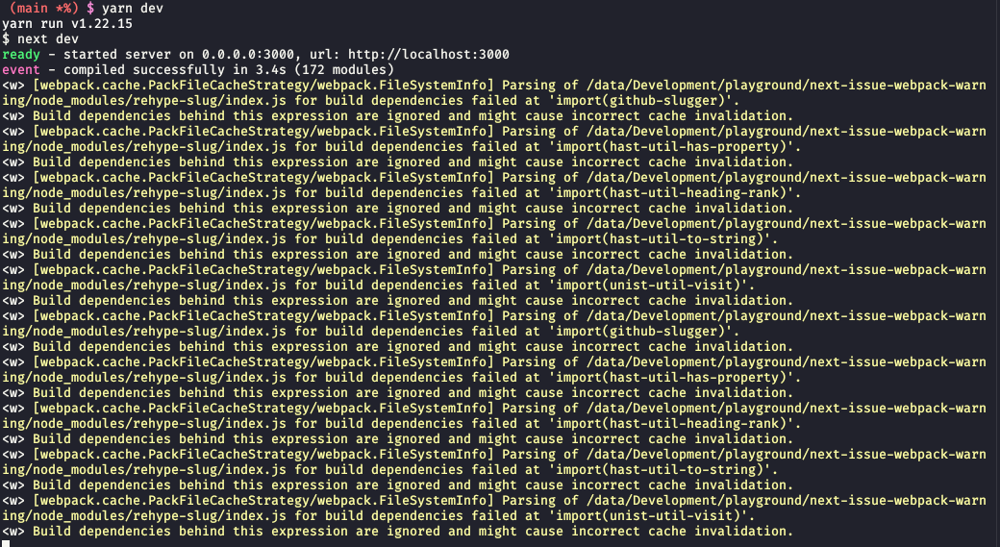

# PackFileCacheStrategy warings

Run `yarn dev` and see lots of warnings about:

```
<w> [webpack.cache.PackFileCacheStrategy/webpack.FileSystemInfo] Parsing of /data/Development/playground/next-issue-webpack-warning/node_modules/rehype-slug/index.js for build dependencies failed at 'import(github-slugger)'.
```


